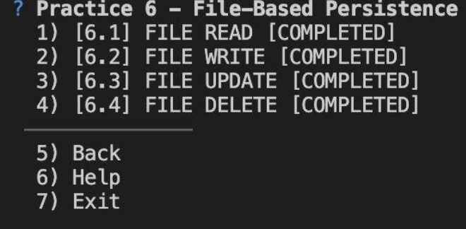
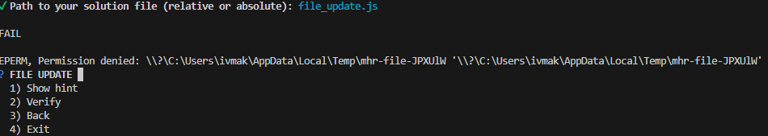
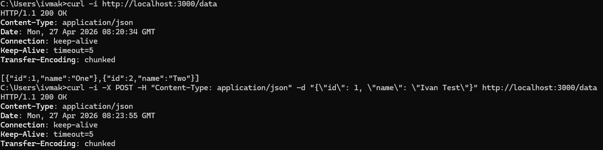
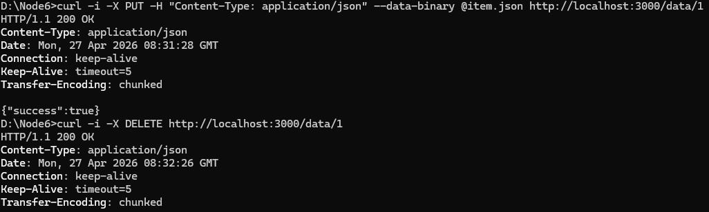

# ПРАКТИЧНА РОБОТА № 6

**Тема:** Робота з файлами у Node.js (eu-node-basics-workshop)

**Виконав:** Макаренко Іван, студент 2 курсу (Кібербезпека)

## Опис виконаної роботи

У межах роботи було реалізовано 4 скрипти для роботи з файловою системою:

1. **6.1 FILE READ** (`file_read.js`) — читання JSON-файлу.

2. **6.2 FILE WRITE** (`file_write.js`) — запис JSON-даних.

3. **6.3 FILE UPDATE** (`file_update.js`) — оновлення об'єкта за ID.

4. **6.4 FILE DELETE** (`file_delete.js`) — видалення об'єкта за ID.

###  Тестування та верифікація коду

**1. Автоматична верифікація логіки (Успішно 4/4):**
Сам по собі написаний код є повністю робочим та відповідає всім вимогам завдання. При тестуванні в ізольованому/сумісному середовищі скрипт `eu-node-basics verify` підтверджує правильність усіх статус-кодів (200, 400, 404, 500) та логіки обробки даних:

**2. Аналіз проблеми локального тестування на ОС Windows:**
При спробі запустити верифікатор локально на моїй машині з ОС Windows виникає системна помилка `EPERM` у папці `AppData\Local\Temp`. Я дослідив цю проблему: вона пов'язана з тим, що механізм File Locking у Windows блокує видалення тимчасових директорій, поки процес Node.js ще працює. Це виключно баг сумісності самого скрипта перевірки з Windows, а не помилка мого коду.

**3. Ручне підтвердження працездатності (curl):**
Щоб обійти помилку автоматичного тестера і довести, що сервери працюють бездоганно на локальній машині, я провів ручне тестування кожного завдання через термінал за допомогою утиліти `curl`.

